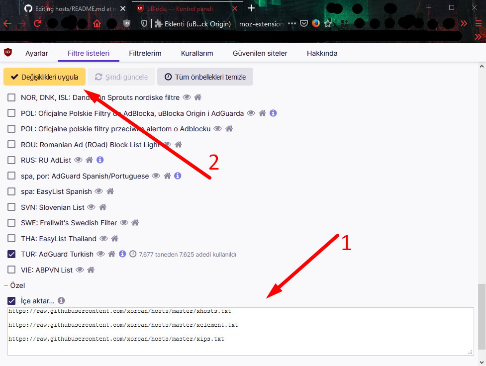
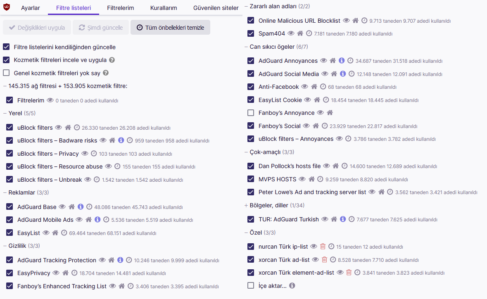

<h2 align="center">
  <a href="https://www.google.com/search?q=t%C3%BCrk%20adlist%20TurkishAdblockList%20Turkish%20Adblock%20List%20huzunluartemis" alt="Annoying Sites huzunluartemis türk-adlist"> 
  </a>
</br>
  <b>Turkish Ad-list, Ad-Block List, HOSTS</b>
</h2>
<h4 align="center">Bahis, dolandırıcılık gibi rahatsız edici siteleri engeller. 
  <a href="https://github.com/huzunluartemis/TurkishAdblockList/blob/main/README-EN.md">English</a>
</h4>
<p align="center">
  <a href="https://www.gnu.org/licenses/gpl-3.0" alt="License: GPLv3">
    
  </a>
  <a href="https://www.google.com/search?q=t%C3%BCrk%20adlist%20TurkishAdblockList%20Turkish%20Adblock%20List%20huzunluartemis" alt="Türkçe Ad-listler">
    
  </a>
  <a href="https://github.com/huzunluartemis/TurkishAdblockList/issues" alt="Hatalar">
    
  </a>
  <a href="https://github.com/huzunluartemis/TurkishAdblockList" alt="Görüntülenme Sayısı">
    
  </a>
</p>

## Kullanım ve Uyarı

AdAway ile kullanınız. -çoğunlukla- Android için tasarlanmıştır. Daha önceden Nano Adblocker tavsiye etmiştim. Nano adblocker artık bir virüs olduğu için cihazlarınızdan **kaldırın** ve **ublock origin** yükleyin!

Ayrıntılı bilgi: [bilgiler 1](https://eksisozluk.com/nano-defender--5646917?a=nice) - [bilgiler 2](https://eksisozluk.com/nano-adblocker--5649314?a=nice)

## Windows/Linux/Mac için Önerilen

- İnternet tarayıcınızda [ublock origin](https://github.com/gorhill/uBlock) kullanarak etkin bir şekilde element filtrelemesi yapabilirsiniz. Bunun için öncelikle tarayıcınız için olanını edinin: [Chrome için](https://chrome.google.com/webstore/detail/ublock-origin/cjpalhdlnbpafiamejdnhcphjbkeiagm?hl=tr) - 
[Firefox için](https://addons.mozilla.org/tr/firefox/addon/ublock-origin/) - [Edge için](https://microsoftedge.microsoft.com/addons/detail/ublock-origin/odfafepnkmbhccpbejgmiehpchacaeak) - [Opera için](https://microsoftedge.microsoft.com/addons/detail/ublock-origin/odfafepnkmbhccpbejgmiehpchacaeak)

- Ardından **ublock origin > Kontrol Paneli > Süzgeç Listeleri > İçe Aktar (en altta)** bölümünden açılan url ekleme kutusuna şu linkleri ekleyin:

```
https://raw.githubusercontent.com/huzunluartemis/TurkishAdblockList/main/src/HostsList.txt
https://raw.githubusercontent.com/huzunluartemis/TurkishAdblockList/main/src/BadIpList.txt
https://raw.githubusercontent.com/huzunluartemis/TurkishAdblockList/main/src/ElementalList.txt
```

- Tavsiye ettiğim listeler (ben de kullanıyorum):

```
https://gitlab.com/anarcho-copy/block-fake-pdf-sites/-/raw/master/output/hosts
https://raw.githubusercontent.com/bkrucarci/turk-adlist/master/hosts
https://raw.githubusercontent.com/bkrucarci/turk-adlist/master/filters/turkish_generic_content_blocker.txt
https://raw.githubusercontent.com/bkrucarci/turk-adlist/master/filters/I-Do-Not-Want-Your-Mobile-App.txt
https://www.i-dont-care-about-cookies.eu/abp/
https://raw.githubusercontent.com/rampageX/fuckfuckadblock/master/my_antiadblock_selection.txt
https://zerodot1.gitlab.io/CoinBlockerLists/hosts_browser
```
  
- Diğer benzer listeler (ben kullanmıyorum):

```
https://raw.githubusercontent.com/deathbybandaid/piholeparser/master/Subscribable-Lists/ParsedBlacklists/AakList.txt
https://easylist-downloads.adblockplus.org/abp-filters-anti-cv.txt
https://raw.githubusercontent.com/abp-filters/abp-filters-anti-cv/master/turkish.txt
https://raw.githubusercontent.com/biroloter/Mobile-Ad-Hosts/master/hosts
https://raw.githubusercontent.com/deathbybandaid/piholeparser/master/Subscribable-Lists/ParsedBlacklists/Turk-adlist.txt
```

- Beyaz Liste (AdAway için, bilmiyorsan es geç.)

```
https://raw.githubusercontent.com/huzunluartemis/TurkishAdblockList/main/src/WhiteList.txt
```



- Ardından sağ üstte beliren **"Değişiklikleri Kaydet"** düğmesine tıklayarak sayfadan çıkabilirsiniz. 
- Artık ayarlar sayfasına girip **"Güncelle"** tuşuna basmanıza gerek yok. Liste diğer listelerin yaptığı gibi belli aralıklarla kendini güncelleyecektir. 

## Ayarlamalarınız Bittiğinde Şöyle Görünmelidir:



## Windows için Önerilmeyen nedir?

**Bu yalnızca gelişmiş kullanıcılar içindir. Ne olduğunu bilmiyorsanız bu ayarı yapmayın!**

Aşağıdaki adrese girerek listenin tamamını kopyalayın:

```https://raw.githubusercontent.com/huzunluartemis/TurkishAdblockList/main/src/HostsList.txt```

- Bilgisayarınızda C:\Windows\System32\drivers\etc konumundaki hosts dosyasını bulun.
- hosts dosyasını notepad++ ile açarak listeyi buraya yapıştırın ve kaydedip çıkın.
- Bilgisayarınızı yeniden başlatın.
- Bu yöntem ayrıca hiçbir cihaz için önerilmez.
- En iyisi tarayıcınıza kurmaktır. ublock origin kullanarak.

## Android için Seçenekler

Ücretsiz yazılımlar genelde hosts seviyesinde reklam engelleyebilmekte ve çoğu zaman uygulamalarda reklamları engelleyememektedir. 

### Android için AdGuard // ücretli - cihaz kök-erişimli değilse
Android için AdGuard yazılımı bu konuda en iyisi denilebilir. Ücretli (Premium) sürümde birçok filtre kullanma imkanı size sunuyor ve daha gelişmiş bir reklam engelleme teknolojisi kullanıyor. Dediğim gibi bu uygulama ücretlidir ve [Google reklam politikalarının işine gelmedeği için Google Play'den kaldırılmıştır](https://blog.adguard.com/en/google-removes-adguard-android-app-google-play/).
- [Android için AdGuard](https://adguard.com/tr/adguard-android/overview.html)
- Kurulum ve kullanımı kolaydır, ROOT gerektirmez.
- 14 gün ücretsiz tam sürümü deneyebilirsiniz,
- Ayarlardan istediğiniz filtreleri (yukarıdaki filtrelerin aynılarını) etkinleştirebilirsiniz.
- Filtreleme yöntemini "Yüksek Kaliteli" yapın.
- HTTPS kullanan reklam ağlarını ve uygulamaları (Youtube reklamları gibi) engelleyebilir.

### DNS66 // ücretsiz - cihaz kök-erişimli değilse

Telefonunuzda root işlemi yapmak zor ve riskli olabilir. Telefonunuzu garanti kapsamı dışına çıkarabilir. Telefonunuz root edilmemiş ise aşağıdaki adımlarla reklamları engelleyebilirsiniz.

- [DNS66](https://github.com/julian-klode/dns66/releases) uygulamasını (Assets kısmındaki ".apk" uzantılı ve her zaman en üsttteki dosyayı) indirin.
- Bilinmeyen kaynaklar uyarısına izin verin. Uygulamayı telefonunuza / tabletinize kurun.
- Uygulamayı açın, alt bölümde "Domain Filters" sekmesine dokunun.
- Sağ alt taraftaki artı (artı) ikonuna dokunun ve aşağıdaki değerleri yazın.
- Title: huzunluartemis TurkishAdblockList
- Location: ```https://raw.githubusercontent.com/huzunluartemis/TurkishAdblockList/main/src/HostsList.txt```
- Action: Deny
- Sağ üstten "Save" diyerek bu ayarları kaydedin. Yukarıdaki yenile butonuna dokunarak güncellemeleri indirin.
- Start/Stop menüsüne geçin, ekrana uzunca dokunun ve filtrelemeyi etkinleştirin.
- Eğer bildirim alanında anahtar işareti görüyorsanız, filtrelerimiz etkindir. Reklamsız gezinebilirsiniz.

### AdAway (Root) // ücretsiz, önerilen, şarj dostu, cihaz kök-erişimliyse

Root erişim izniniz varsa telefonun kendi "hosts" dosyasını değiştirmelisiniz. Bu, batarya ve RAM tasarrufu sağlar.
Kök erişim (root) izniniz varsa AdAway uygulamasını kullanabilirsiniz. Host dosyaları ile reklam engelleyen ücretsiz bir uygulamadır.

- AdAway uygulamasını [buradan](https://github.com/AdAway/AdAway/releases) (Assets kısmındaki ".apk" uzantılı ve her zaman en üsttteki dosyayı) indirin.
- Uygulamayı telefonunuza veya tabletinize kurun.
- Uygulamayı açın ve uygulama menüsünden "Host kaynakları" sekmesini açın.
- Sağ üst köşedeki '+' işaretine dokunun. Bir bağlantı girmeniz istenecektir.
- Aşağıdaki adreslerden **olmayanları** kopyalayıp bu kısma yapıştırın ve ekleyin.
- (Bunlar benim önerilerim ve normal Android kullanıcıları için yeterlidir. Ben daha fazla istiyorum diyorsanız [şuraya](https://github.com/huzunluartemis/TurkishAdblockList/blob/master/OTHERS.md) bakabilirsiniz.)

```
https://raw.githubusercontent.com/huzunluartemis/TurkishAdblockList/main/src/HostsList.txt
https://adaway.org/hosts.txt
https://hosts-file.net/ad_servers.txt
https://pgl.yoyo.org/adservers/serverlist.php?hostformat=hosts&showintro=0&mimetype=plaintext
https://raw.githubusercontent.com/StevenBlack/hosts/master/hosts
https://someonewhocares.org/hosts/hosts
https://s3.amazonaws.com/lists.disconnect.me/simple_malvertising.txt
```

- Ayrıca şu listeyi güvenilir olarak eklemenizi tavsiye ederim. AdAway'de whitelist ya da beyaz liste diye seçiliyor. WhiteList olarak ekleyin: `https://raw.githubusercontent.com/huzunluartemis/TurkishAdblockList/main/src/WhiteList.txt`
- Ana menüye dönün, güncellemeleri denetleyip uygulayın. Cihazınızı yeniden başlatın.

### Eklenti destekleyen tarayıcılar // ücretsiz, cihaz kök-erişimli değilse

Kiwi Browser veya Mozilla Firefox gibi eklenti desteği olan bir tarayıcıda, eklentiler bölümünden ublock origin kurarak aynı işlemleri uygulayabilirsiniz.

## [Diğer listeler](https://github.com/huzunluartemis/TurkishAdblockList/blob/master/OTHERS.md)

## Özel Durumlar

Burada belirtilen durumlar dosyalarda bulunmadığı için manuel olarak ayarlamalıdır. Şu kurallara göre uygulayınız:

- karalisteye eklemek için: "adaway > your" lists alanına girin. altta "blacklist" seçili olduğundan emin olduktan sonra "+ (uçan buton)" işaretine tıklayıp belirtilen kısmı yazın.
- beyazlisteye eklemek için: "adaway > your" lists alanına girin. altta "whitelist" seçili olduğundan emin olduktan sonra "+ (uçan buton)" işaretine tıklayıp belirtilen kısmı yazın.

## Rahatsız Siteyi Nasıl Bildireceğim?

Engellenmesini uygun gördüğünüz siteleri [Hatalar](https://github.com/huzunluartemis/TurkishAdblockList/issues) kısmından bildirin, listeye ekleyelim ki diğer insanlar bunlarla uğraşmasınlar. 

## Uyarı

Bu makaledeki uygulamaların gizlilik sözleşmelerini okuyunuz. Eğer ne yaptığınızı bilmiyorsanız bu işlemlerden uzak durun. Her cihazın yapısı farklıdır, oluşabilecek sorunlardan makale editörü sorumlu tutulamaz.

## Orijinal Depo

Bu depo, güncelliğini yitirmiş olan orijinal deponun bir çatallamasıdır. Orijinal depoya bu harika çalışma için teşekkürler: [xorcan/hosts](https://github.com/xorcan/hosts)

## Lisans

[](http://www.gnu.org/licenses/gpl-3.0.en.html)  

Tüm sorumluluk kullanıcıya aittir. Kullanabilir, çalışabilir ve paylaşmayı istediğiniz gibi geliştirebilirsiniz. Özellikle, Özgür Yazılım Vakfı tarafından yayımlanan [GNU Genel Kamu Lisansı](https://www.gnu.org/licenses/gpl.html) koşulları altında, lisansın 3. sürümü veya daha sonraki sürümlerinde yeniden dağıtabilir ve/veya değiştirebilirsiniz.
